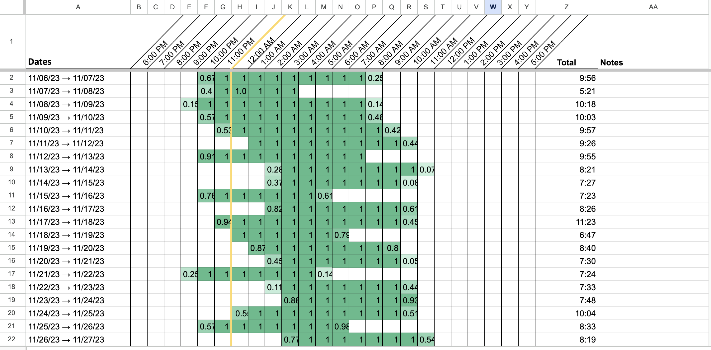

<h1 align="center">Sleep Data Processor</h1>

<p align="center">
  <a href="LICENSE"></a>
  
  
  
</p>

<p align="center"><strong>Turn a Sleep Cycle export into a chart of your real sleep pattern: one row per night, one column per hour.</strong></p>

<p align="center">
  
</p>

---

## About

Sleep Cycle records the nights you sleep, but its own history view does not show the shape of a sleep pattern over months. This project reads a Sleep Cycle CSV export and writes the rows that a [Google Sheets chart template](https://docs.google.com/spreadsheets/d/1bae1Rd7Ow1-quu7ddtPsrhsauH6KFFqn4suwRdhfGoM/edit?usp=sharing) draws as a clock grid: nights down the page, the 24 hours across it, each night's sleep filled in.

A sleep chart is a standard tool used to look at sleep timing and circadian rhythm, the same shape as a sleep diary a clinician would ask for. It is useful for two things: seeing what your pattern actually is rather than what you remember it being, and having a before to compare against when you change something.

## Two ways to use it

| | Who it is for | What you run |
|---|---|---|
| **Chart My Sleep** (web) | Anyone. Nothing to install. | Paste your export into the page |
| **PHP script** (this repo) | People who prefer the command line or want to script it | `php -f bin/process-chart.php` |

Both produce identical output. The browser module is a transcription of the PHP class and is verified against it by diffing the output of both over the same input.

### The web version

Access at: 
https://josh5a.github.io/sleep-data-processor/

| Page | What it is for |
|---|---|
| `/` | What the tool is and why the chart is worth making |
| `/chart` | The tool itself. Paste or drop your export, copy the rows out |
| `/export` | How to get the export out of Sleep Cycle |
| `/howtoread` | How to read the chart once you have one |
| `/track` | For people who have no sleep data yet |
| `/notes` | The caveats, in full |
| `/privacy` | What the site does and does not do with your data |

The page does the conversion in your own browser. Nothing is uploaded, there is no analytics, no storage and no network request of any kind after the page loads. The final step, drawing the chart, happens in your own Google account using the Sheets template.

## Quick start (PHP)

> [!IMPORTANT]
> Requires PHP 7.4 or later. There is nothing to install: no Composer, no extensions beyond the defaults.

```bash
git clone https://github.com/Josh5A/sleep-data-processor.git
cd sleep-data-processor

# copy your Sleep Cycle export to files/sleepdata.csv and then:

php -f bin/process-chart.php
```

By default it reads `files/sleepdata.csv` and writes `files/sleep_chart_output.tdv`. Both can be given as arguments instead:

```bash
php -f bin/process-chart.php ~/Downloads/sleepdata.csv ~/Desktop/chart.tdv
```

## Usage

1. **Export your data from Sleep Cycle.** It is buried in the app's settings. [Sleep Cycle's own instructions](https://support.sleepcycle.com/hc/en-us/articles/12221835792796-I-d-like-to-export-my-data-from-Sleep-Cycle), or the iOS walkthrough with screenshots at https://josh5a.github.io/sleep-data-processor/export
2. **Put `sleepdata.csv` in `files/`**, or pass its path as the first argument.
3. **Run the script.** It writes `files/sleep_chart_output.tdv`.
4. **Make your own copy of the [Sheets template](https://docs.google.com/spreadsheets/d/1bae1Rd7Ow1-quu7ddtPsrhsauH6KFFqn4suwRdhfGoM/copy)** (File > Make a copy). First time only.
5. **Open the `.tdv` file, select all, copy, click cell A2 in your Sheet, and paste.** The chart appears beside the rows.

### Updating an existing chart

Sleep Cycle exports your whole history every time, so an update is the same paste again: click A2 and paste over the top. It replaces the rows rather than appending to them, and anything you typed in the notes column is kept, because the paste only covers the sleep hour columns.

## Output format

Tab-delimited, one line per night, 26 columns:

| Column | Holds | Example |
|---|---|---|
| A | The night, as the two dates it spans | `10/21/23 → 10/22/23` |
| B to Y | One column per hour, midnight to 11pm. How much of that hour was spent in bed, 0 to 1 | `0.93` |
| Z | Total time in bed that night, `HH:MM` | `12:59` |

Times are handled as a linear count of wall clock seconds rather than as timestamps, so output does not depend on the machine's timezone, and a wall clock time that never existed (the hour skipped when the clocks go forward) stays unambiguous.

## Caveats

> [!WARNING]
> On the two nights a year when the clocks change, the hour columns will not add up to the total. 1am happens twice on one of them and 2am never happens on the other. The total at the end of the row is still your real time in bed.

These are hours **in bed**, not hours **asleep**. Sleep Cycle estimates time asleep separately; the chart draws time in bed, because that is the measure a sleep diary uses and the one that is consistent across every night in the file. The fuller set of caveats is at  https://josh5a.github.io/sleep-data-processor/notes.

## Project layout

| Path | What is in it |
|---|---|
| `src/SleepDataProcessor.php` | The processor. All the parsing and the maths |
| `bin/process-chart.php` | Command line entry point |
| `files/` | Where your export goes in and the output comes out |
| `docs/` | The Chart My Sleep website, served by GitHub Pages |
| `docs/assets/js/sleep-data-processor.js` | The browser module: same algorithm, no DOM, no network |

## License

[GPL-3.0](LICENSE) © Josh Alexander
